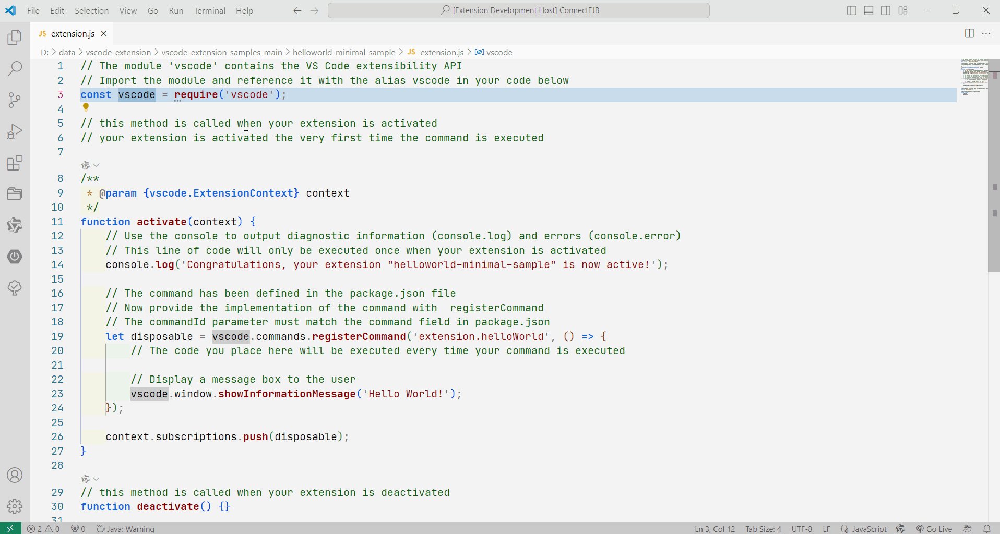

# Word Jump

Jump between identical words.

## Usage
1. Through the Command Palette. 
2. Enter 'Open Jump' to display the "Up" and "Down" button on the left side of the status bar.
2. Enter 'Close Jump' to hide the "Up" and "Down" button on the left side of the status bar.

## example
